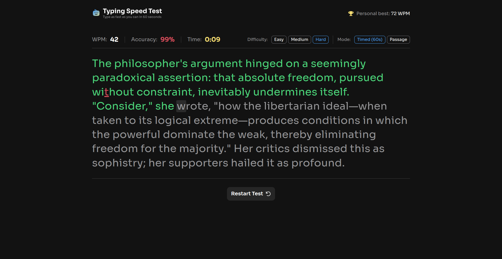

# Frontend Mentor - Typing Speed Test solution

This is a solution to the [Typing Speed Test challenge on Frontend Mentor](https://www.frontendmentor.io/challenges/typing-speed-test). Frontend Mentor challenges help you improve your coding skills by building realistic projects.

## Table of contents

- [Overview](#overview)
  - [The challenge](#the-challenge)
  - [Screenshot](#screenshot)
  - [Links](#links)
- [Built with](#built-with)
- [Author](#author)

## Overview

### The challenge

Users should be able to:

- View the optimal layout for the interface depending on their device's screen size
- See hover and focus states for all interactive elements on the page

### Screenshot

### Links

- Solution URL: [Frontend Mentor Solution](https://www.frontendmentor.io/solutions/typing-speed-test-XsXfXyaA4a)
- Live Site URL: [Github Pages](https://sam4web.github.io/typing-speed-test/)

## Built with
- [Vue](https://vuejs.org/)
- [Tailwind](https://tailwindcss.com/)
- TypeScript
- Semantic HTML5 markup
- Mobile-first workflow

## Author

- Website: [Sijal Manandhar](https://sijalmanandhar.com.np/)
- Frontend Mentor: [@sam4web](https://www.frontendmentor.io/profile/sam4web)
- Github: [@sam4web](https://github.com/sam4web)
